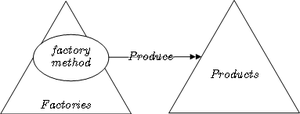
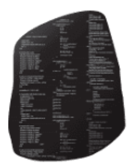
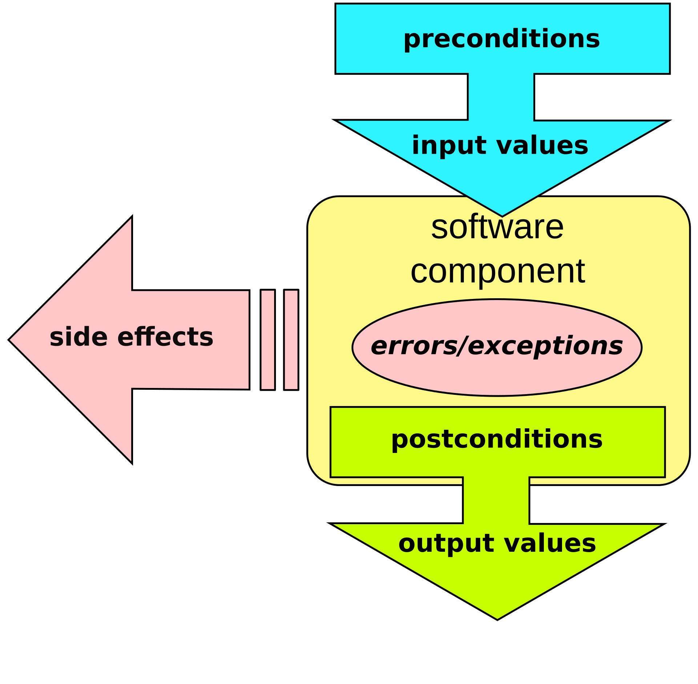
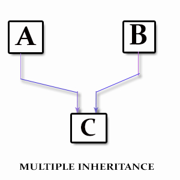
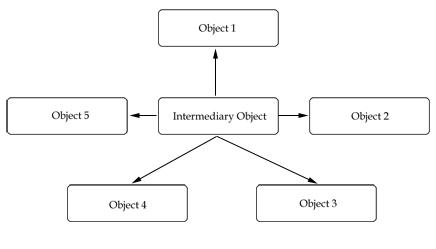
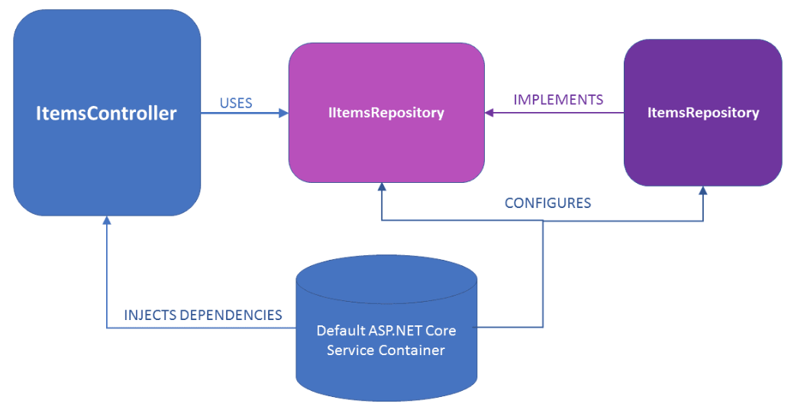

In _Object-oriented programming_, SOLID is a mnemonic acronym for 5 design principles intended to make software designs more understandable, flexible and maintainable. 

<!-- end -->

## Design Principles

- S--_Single Responsibility_
- O--_Open/Closed_
- L--_Liskov Substitution_
- I--_Interface Segregation_
- D--_Dependency Inversion_

### Single Responsibility

> "A class should have one and only one reason to change."

Meaning that a class should only have one job. The [Factory Pattern](https://en.wikipedia.org/wiki/Factory_(object-oriented_programming)) determine an interesting way to handle repetitive task pattern. Objects factory **parameters definition** quick-start production with minimal constraints. 

<div class="custom-images" style="max-width: 400px; margin: 40px auto;">
	
</div>

### Open / Closed

Objects or entities should be open for extension but closed for modification. Open for extension means that we should be able to add new features or components to the application without breaking existing code.

> "Closed for modification means that we should not introduce breaking changes to existing functionality, because that would force you to refactor a lot of existing code." [Eric Elliott](https://medium.com/@_ericelliott)

In simpler words, means that a class or factory function in our case, it should be easily extendable without modifying the class or function itself.

Coding to an interface is an integral part of S.O.L.I.D. Every shape must implements interfaces. You can also use abstract classes, and refer to [RosettaCode](https://rosettacode.org/wiki/Function_composition) to identify the shape corresponding to the langage your are using **function composition** i.e. : **one argument**, only.

<div class="custom-images" style="width: 100px; margin: 30px auto;">
	
</div>

### Liskov Substitution

Derived classes must be substitutable for their base classes. What is wanted here is something like the following substitution property: 

> "If, for each object A of type S there is an object B of type T, such that for all programs P defined in terms of T, the behavior of P is unchanged when A is substituted for B then S is a subtype of T." [Barbara Liskov](http://www.pmg.csail.mit.edu/~liskov/)

Each method should have preconditions and posconditions defined. Preconditions must hold true in order for a method to execute, and postconditions must hold true after the execution of a method. It's what [Robert C. Martin](https://twitter.com/unclebobmartin?ref_src=twsrc%5Egoogle%7Ctwcamp%5Eserp%7Ctwgr%5Eauthor) suggests as : [Design by Contract](https://en.wikipedia.org/wiki/Design_by_contract).

<div class="custom-images" style="max-width: 280px; margin: 30px auto -30px auto;">
	
</div>

> "When redefining a routine (in a derivative for example), you may only replace its precondition by a weaker one, and its postcondition by a stronger one." [Bertrand Meyer](https://bertrandmeyer.com/)

Robert C. Martin also suggests that it is helpful to document (comments) the preconditions and postconditions for each method. From my point of view, **YAGNI** principle is right in that context too: "[You aren't gonna need it](https://en.wikipedia.org/wiki/You_aren%27t_gonna_need_it)". Forget about comments, it's systems most common weakness. If your code isn't strong enough to be read without comments, REWRITE !! before saving anything else.

### Interface Segregation

The _Interface Segregation Principle_ was defined by Robert C. Martin while consulting for Xerox to help them build the software for their new printer systems. He defined it as:

> “Clients should not be forced to depend upon interfaces that they do not use.”

The goal of this is to reduce the side (ripple) effects and frequency of required changes by splitting the software into multiple and independent parts.

For example, let’s say we had an interface called Animal, which would have eat, sleep and walk methods. This would mean that we have a monolithic interface called Animal, which would not be the perfect abstraction, because some animals can fly. Breaking this monolithic interface into smaller interfaced based by role, we would get CanEat, CanSleep and CanWalk interfaces. This would then make it possible for a species to eat, sleep and for example fly. A species would be a combination of roles, instead of being characterized as an animal, which would not necessarily be the best description. At a larger scale, microservices are a very similar case, they are pieces of a system separated by responsibilities, instead of being a great monolith.

<div class="custom-images" style="width: 200px; margin: 0 auto;">
	
</div>

By breaking down interfaces, we favor Composition instead of Inheritance, and Decoupling over Coupling. [Coupling](https://gamedevelopment.tutsplus.com/tutorials/quick-tip-the-oop-principle-of-coupling--gamedev-1935) is the principle of reducing how objects directly affect the states and behaviors of other objects. Coupling helps to create code that is easier to read as well as easier to change. It is the principle behind : **Separation of Concerns**.

> "One object doesn't directly change or modify the state or behavior pf another object."



```javascript 
	public class Game { 
		if (Pac-Man.eats(Power_Pellet)) {
			Ghosts.changeState();
		}
	}
```


### Dependency Inversion

Depend on abstractions, not on concretions.

> "Abstractions should not depend upon details. Details should depend upon abstractions."

High level modules should not depend upon low level modules. Both should depend upon abstractions. Let’s say we have a system that handles authentication through external services such as Google, GitHub, etc. We would have a class for each service: 

- GoogleAuthenticationService
- GitHubAuthenticationService 
- etc. 

Now, let’s say that some place in our system, we need to authenticate our user. We have two possibilities: 

1) Adapt each service to the authentication process 
2) Define an abstraction of the authentication services.

The first possibility is a dirty solution that will potentially introduce technical debt in the future; in case a new authentication service is to be integrated to the system, we will need to change the code, which as a result violates the OCP. 

The second possibility is much cleaner, it allows for future addition of services, and changes can be done to each service without changing the integration logic. By defining a AuthenticationService interface and implementing it in each service, we would then be able to use [Dependency Injection](https://philippe.developpez.com/articles/dotnet/injectiondedependances/) in our authentication logic and have our authentication method signature look something like this: authenticate(AuthenticationService authenticationService). 



Then, we could authenticate by a specific service like this: authenticate(new GoogleAuthenticationService). This helps us generalize the authentication logic without having to integrate each service separately. By depending on higher-level abstractions, we can easily change one instance with another instance in order to change the behavior. Dependency Inversion increases the reusability and flexibility of our code.

Further reading -> [Don't blame the dependency injection framework](https://www.continuousimprover.com/2018/05/dont-blame-dependency-injection.html)

## Benefits

Following principles always has benefits. It is no different in software engineering. Following the SOLID Principles gives us many benefits, they make our system :

- _reusable_
- _maintainable_
- _scalable_
- _testable_
- _..._

For more about the benefits of each of these principles, make sure to read Uncle Bob’s articles, and communicate about your own experiences.

Thank you _Stranger_, see you next time, for another coffee-programming session.

_Going further: **DRY Principle, Encapsulation, Premature Optimization, Refactoring, Software Craftmanship, Clean Code and Style Guides**._