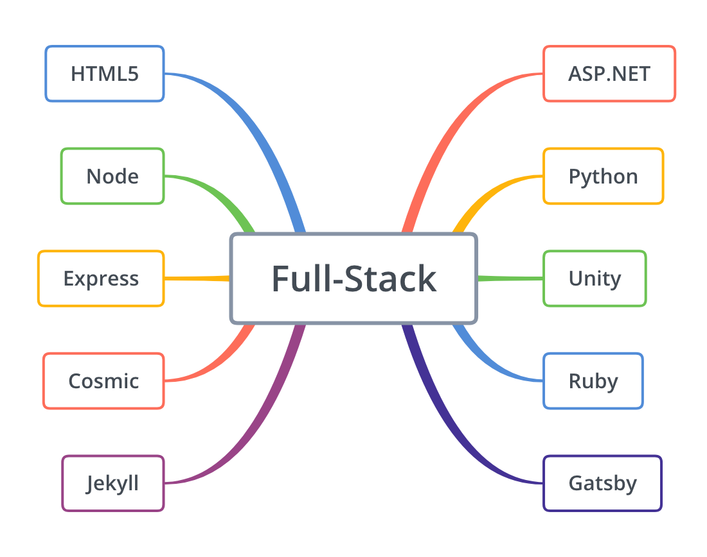

This page aims at showing at a glance my research path, founds, and gems. 
There is a lot of burning topics nowadays ! 
Main frameworks I am using today are presented in the section below, you can also have a look at my Bookmarks if you want, I will do my best to keep this list updated regularly.

<!-- end -->

## IDE

My development environment is based on shared projects between MacOS and Windows, Back/Front-End development and 3D environments. Configuring Windows to execute Linux command, and merging frames in Visual Studio Code makes the bridge between those two. Thank you Microsoft for your last actions towards community developers. Open-source softwares will win, at the very end.

## Frameworks

I currently enjoy front development libraries based on Javascript like [Jekyll](https://jekyllrb.com/) and [Gatsby](https://www.gatsbyjs.org/). Deployment from [Npm](https://www.npmjs.com/) is like having a terminal copilot which does the main part of the job for you. It takes a few time to obtain a stable environment but it really worth the time !

## Bookmarks

<DT><H3 FOLDED>Novembre</H3>
			<DL>

				<DT><H3 FOLDED>18/11/25</H3>
				<DL>

					<DT><A HREF="https://www.creativebloq.com/html5/build-tile-based-html5-game-31410992">Build a tile-based HTML5 game | Creative Bloq</A>
				</DL>

				<DT><H3 FOLDED>18/11/26</H3>
				<DL>

					<DT><A HREF="https://www.sitepoint.com/understanding-requirejs-for-effective-javascript-module-loading/">Understanding RequireJS for Effective JavaScript Module Loading</A>
					<DT><A HREF="https://medium.freecodecamp.org/requiring-modules-in-node-js-everything-you-need-to-know-e7fbd119be8">Requiring modules in Node.js: Everything you need to know</A>
				</DL>

				<DT><H3 FOLDED>18/11/27</H3>
				<DL>

					<DT><A HREF="https://github.com/Microsoft/vscode/issues/14896">how to hide sidebar · Issue #14896 · Microsoft/vscode</A>
				</DL>

				<DT><H3 FOLDED>18/11/28</H3>
				<DL>

					<DT><A HREF="https://github.com/Microsoft/vscode-ios-web-debug">Microsoft/vscode-ios-web-debug: Debug your JavaScript code running in Safari on iOS devices from VS Code.</A>
					<DT><A HREF="https://github.com/RemoteDebug/remotedebug-ios-webkit-adapter#getting-started">RemoteDebug/remotedebug-ios-webkit-adapter: Debug Safari and WebViews on iOS from tools like VS Code, Chrome DevTools, Mozilla Debugger.html</A>
					<DT><A HREF="https://medium.com/@auchenberg/hello-remotedebug-ios-webkit-adapter-debug-safari-and-ios-webviews-from-anywhere-2a8553df7465">Hello RemoteDebug iOS WebKit Adapter: Debug Safari and iOS WebViews from anywhere 📡📱</A>
					<DT><A HREF="https://docs.unity3d.com/Manual/HOWTO-exportFBX.html#Max">Unity - Manual: Exporting from other applications</A>
				</DL>

				<DT><H3 FOLDED>18/11/29</H3>
				<DL>

					<DT><A HREF="https://medium.com/@mfosullivan/a-beginners-guide-to-setting-up-a-modern-web-development-environment-on-windows-10-4d75cd94cde8">A beginners guide to setting up a modern web development environment on Windows 10</A>
					<DT><A HREF="https://code.visualstudio.com/docs/getstarted/settings">Visual Studio Code User and Workspace Settings</A>
					<DT><A HREF="https://code.visualstudio.com/docs/editor/integrated-terminal">Integrated Terminal in Visual Studio Code</A>
					<DT><A HREF="https://code.visualstudio.com/docs/editor/multi-root-workspaces#_settings">Multi-root Workspaces in Visual Studio Code</A>
					<DT><A HREF="https://linuxize.com/post/how-to-install-yarn-on-ubuntu-18-04/">How to install Yarn on Ubuntu 18.04 | Linuxize</A>
					<DT><A HREF="https://askubuntu.com/questions/334994/which-one-is-better-using-or-to-execute-multiple-commands-in-one-line">bash - Which one is better: using ; or &amp;&amp; to execute multiple commands in one line? - Ask Ubuntu</A>
					<DT><A HREF="https://support.google.com/chrome/answer/157179?hl=en">Chrome keyboard shortcuts - Google Chrome Help</A>
				</DL>

				<DT><H3 FOLDED>18/11/30</H3>
				<DL>

					<DT><A HREF="https://stackoverflow.com/questions/8988855/include-another-html-file-in-a-html-file">Include another HTML file in a HTML file - Stack Overflow</A>
					<DT><A HREF="https://www.html5rocks.com/en/tutorials/webcomponents/imports/">HTML Imports: #include for the web - HTML5 Rocks</A>
					<DT><A HREF="https://jekyllrb.com/docs/themes/">Themes | Jekyll • Simple, blog-aware, static sites</A>
					<DT><A HREF="https://help.github.com/articles/adding-a-jekyll-theme-to-your-github-pages-site-with-the-jekyll-theme-chooser/">Adding a Jekyll theme to your GitHub Pages site with the Jekyll Theme Chooser - User Documentation</A>
					<DT><A HREF="https://git-scm.com/docs/git-clone">Git - git-clone Documentation</A>
					<DT><A HREF="https://git-scm.com/book/en/v2/Git-Basics-Working-with-Remotes">Git - Working with Remotes</A>
					<DT><A HREF="http://jekyllthemes.org/themes/airspace/">Airspace</A>
					<DT><A HREF="https://help.github.com/articles/adding-an-existing-project-to-github-using-the-command-line/">Adding an existing project to GitHub using the command line - User Documentation</A>
					<DT><A HREF="https://help.github.com/articles/setting-your-commit-email-address-in-git/">Setting your commit email address in Git - User Documentation</A>
					<DT><A HREF="https://help.github.com/articles/error-permission-denied-publickey/">Error: Permission denied (publickey) - User Documentation</A>
				</DL>

			</DL>

			<DT><H3 FOLDED>Décembre</H3>
			<DL>

				<DT><H3 FOLDED>18/12/01</H3>
				<DL>

					<DT><A HREF="https://github.com/themefisher/airspace-free-html5-agency-template">themefisher/airspace-free-html5-agency-template</A>
					<DT><A HREF="https://stackoverflow.com/questions/33201630/install-gem-gives-failed-to-build-gem-native-extension">ruby - Install gem gives "Failed to build gem native extension." - Stack Overflow</A>
					<DT><A HREF="https://rubygems.org/gems/jekyll-airspace/versions/0.1.0">jekyll-airspace | RubyGems.org | votre communauté d'hébergement des gems</A>
					<DT><A HREF="https://webdesign.tutsplus.com/tutorials/how-to-set-up-a-jekyll-theme--cms-26332">How to Set Up a Jekyll Theme</A>
					<DT><A HREF="https://jekyllrb.com/docs/usage/">Command Line Usage | Jekyll • Simple, blog-aware, static sites</A>
					<DT><A HREF="https://jekyllrb.com/docs/">Quickstart | Jekyll • Simple, blog-aware, static sites</A>
					<DT><A HREF="https://stackoverflow.com/questions/20559255/error-while-installing-json-gem-mkmf-rb-cant-find-header-files-for-ruby">Error while installing json gem 'mkmf.rb can't find header files for ruby' - Stack Overflow</A>
					<DT><A HREF="https://stackoverflow.com/questions/24423067/missing-folder-in-repository-after-git-add">missing folder in repository after git add - Stack Overflow</A>
					<DT><A HREF="https://www.html5rocks.com/en/tutorials/speed/parallax/">Parallaxin' - HTML5 Rocks</A>
				</DL>

				<DT><H3 FOLDED>18/12/02</H3>
				<DL>

					<DT><A HREF="https://codepen.io/#">CodePen</A>
					<DT><A HREF="http://www.brainbell.com/tutors/C_Sharp/Instantiation.htm">Instantiation : C Sharp</A>
					<DT><A HREF="https://philippe.developpez.com/articles/SOLIDdotNet/#LVI%20-%20C">Bonnes pratiques objet en .net : Introduction aux principes SOLID</A>
					<DT><A HREF="https://philippe.developpez.com/articles/dotnet/injectiondedependances/">Injection de dépendances en .NET, pattern, intérêt et outils</A>
				</DL>

				<DT><H3 FOLDED>18/12/03</H3>
				<DL>

					<DT><A HREF="https://code.visualstudio.com/docs/python/python-tutorial">Get Started Tutorial for Python in Visual Studio Code</A>
					<DT><A HREF="https://code.visualstudio.com/docs/python/environments">Using Python Environments in Visual Studio Code</A>
					<DT><A HREF="https://github.com/toxtli/futuristic-3d-spherical-news-visualization-three-js">toxtli/futuristic-3d-spherical-news-visualization-three-js: This is a 3D visualization in javascript that enables spherical, helix, grid and table views using a data-driven approach with three.js</A>
					<DT><A HREF="https://www.w3schools.com/css/css_image_transparency.asp">CSS Image Opacity / Transparency</A>
					<DT><A HREF="http://simplefocus.com/flowtype/">FlowType.JS — Responsive web typography at its finest: font-size and line-height based on element width. | Simple Focus</A>
				</DL>

				<DT><H3 FOLDED>18/12/04</H3>
				<DL>

					<DT><A HREF="http://excamera.com/articles/26/doc/intro.html">Introduction and Cookbook — Python OpenEXR v1.2 documentation</A>
				</DL>

				<DT><H3 FOLDED>18/12/08</H3>
				<DL>

					<DT><A HREF="https://www.gatsbyjs.org/docs/sourcing-from-netlify-cms/">Sourcing from Netlify CMS | GatsbyJS</A>
					<DT><A HREF="https://guides.github.com/features/mastering-markdown/">Mastering Markdown · GitHub Guides</A>
					<DT><A HREF="http://chriseppstein.github.io/blog/2010/08/02/sass-extend-challenge/">Sass Challenge: Use selector inheritance this week</A>
					<DT><A HREF="https://www.codeproject.com/script/Membership/LogOn.aspx?rp=https%3a%2f%2fwww.codeproject.com%2f&download=true">Sign in - CodeProject</A>
					<DT><A HREF="https://developer.mozilla.org/en-US/docs/Learn/CSS/Introduction_to_CSS/Cascade_and_inheritance">Cascade and inheritance | MDN</A>
				</DL>

				<DT><H3 FOLDED>18/12/09</H3>
				<DL>

					<DT><A HREF="https://reactjs.org/docs/dom-elements.html">DOM Elements – React</A>
					<DT><A HREF="https://zhenyong.github.io/react/tips/dangerously-set-inner-html.html">Dangerously Set innerHTML | React</A>
					<DT><A HREF="https://devhints.io/jekyll">Jekyll cheatsheet</A>
					<DT><A HREF="https://imsun.github.io/gitment/">Gitment Demo Page</A>
					<DT><A HREF="https://www.gatsbycentral.com/tutorial-comments-with-staticman-in-gatsby">Tutorial: Comments with StaticMan in Gatsby | Gatsby Central</A>
					<DT><A HREF="https://shopify.github.io/liquid/">Liquid template language</A>
					<DT><A HREF="https://help.shopify.com/en/themes/liquid/basics">Liquid basics · Shopify Help Center</A>
					<DT><A HREF="https://www.sitepoint.com/setting-up-a-living-styleguide-in-jekyll/">Setting up a Living Styleguide in Jekyll — SitePoint</A>
					<DT><A HREF="https://haacked.com/archive/2018/06/24/comments-for-jekyll-blogs/">Comments for Jekyll Blogs | You’ve Been Haacked</A>
					<DT><A HREF="https://darekkay.com/blog/static-site-comments/">Various ways to include comments on your static site</A>
					<DT><A HREF="http://donw.io/post/github-comments/">Replacing Disqus with Github Comments · Gazoo.vrv</A>
					<DT><A HREF="https://news.ycombinator.com/item?id=14170041">Replacing Disqus with GitHub Comments | Hacker News</A>
					<DT><A HREF="https://guides.github.com/activities/hello-world/">Hello World · GitHub Guides</A>
					<DT><A HREF="https://developer.github.com/apps/building-oauth-apps/authorizing-oauth-apps/">Authorizing OAuth Apps | GitHub Developer Guide</A>
					<DT><A HREF="https://github.com/Shopify/liquid">Shopify/liquid: Liquid markup language. Safe, customer facing template language for flexible web apps.</A>
					<DT><A HREF="https://github.com/imsun/gitment">imsun/gitment: A comment system based on GitHub Issues.</A>
					<DT><A HREF="https://help.github.com/articles/setting-up-your-github-pages-site-locally-with-jekyll/">Setting up your GitHub Pages site locally with Jekyll - User Documentation</A>
					<DT><A HREF="http://frontendcollisionblog.com/jekyll/snippet/2015/03/23/how-to-show-a-summary-of-your-post-with-jekyll.html">How to show a summary of your post with Jekyll</A>
				</DL>

				<DT><H3 FOLDED>18/12/18</H3>
				<DL>

					<DT><A HREF="https://medium.com/@jimkang/complete-uninstall-remove-vscode-mac-5e48bef3bdec">Complete uninstall / remove vscode (Mac) – Jim Kang – Medium</A>
					<DT><A HREF="http://osxdaily.com/2009/11/30/open-current-folder-in-finder-from-the-terminal/">Open Current Folder in Finder from Terminal of Mac OS X</A>
					<DT><A HREF="https://help.github.com/articles/changing-a-remote-s-url/">Changing a remote's URL - User Documentation</A>
					<DT><A HREF="https://help.github.com/articles/error-permission-denied-publickey/">Error: Permission denied (publickey) - User Documentation</A>
					<DT><A HREF="https://gist.github.com/adamjohnson/5682757">Fix "Permission denied (publickey)" error when pushing with Git</A>
					<DT><A HREF="https://help.github.com/articles/adding-a-new-ssh-key-to-your-github-account/">Adding a new SSH key to your GitHub account - User Documentation</A>
				</DL>

				<DT><H3 FOLDED>18/12/19</H3>
				<DL>

					<DT><A HREF="https://www.gatsbyjs.org/docs/centralizing-your-sites-navigation/">Centralizing your site's navigation | GatsbyJS</A>
				</DL>

			</DL>

		</DL>

		<DT><H3 FOLDED>Unity</H3>
		<DL>

			<DT><H3 FOLDED>Novembre</H3>
			<DL>

				<DT><H3 FOLDED>18/11/26</H3>
				<DL>

					<DT><A HREF="https://topps.diku.dk/torbenm/maps.msp">Planet Map Generator</A>
					<DT><A HREF="http://wiki.polycount.com/wiki/Cube_map#Reflect.2FRefract_Map">Cube map - polycount</A>
					<DT><A HREF="http://www.pixelsonic.com/2011/04/360%C2%B0-in-3ds-max-with-vray-2/">360° in 3Ds Max with VRay – Pixelsonic – CGI, Visualization and Animation</A>
					<DT><A HREF="https://judegodin.wordpress.com/2011/12/06/how-the-hell-do-i-make-a-cubemap/">How the Hell do I make a cubemap with my own art? | The Art of Jude Godin</A>
					<DT><A HREF="https://github.com/Gamgaroo/Esmeralda">GitHub - Gamgaroo/Esmeralda: ASP.NET Core Web App for hosting Unity3D WebGL builds with support of Continuous Delivery via Unity Cloud Webhooks.</A>
					<DT><A HREF="https://forum.unity.com/threads/enable-fullscreen-webgl.441174/">Enable fullScreen WebGl - Unity Forum</A>
					<DT><A HREF="https://forum.unity.com/threads/tutorial-best-way-to-import-3ds-max-models.470733/">Tutorial: Best way to import 3ds max models - Unity Forum</A>
					<DT><A HREF="https://store.unity.com/products/unity-pro?_ga=2.37608992.1802608666.1543247316-1732892576.1543247316">Unity Pro - Unity Store</A>
					<DT><A HREF="https://docs.unity3d.com/ScriptReference/Screen-fullScreen.html">Unity - Scripting API: Screen.fullScreen</A>
					<DT><A HREF="https://docs.unity3d.com/Manual/class-Cubemap.html">Unity - Manual: Cubemap</A>
					<DT><A HREF="https://docs.unity3d.com/Manual/webgl-interactingwithbrowserscripting.html">Unity - Manual: WebGL: Interacting with browser scripting</A>
					<DT><A HREF="https://docs.unity3d.com/ScriptReference/Transform.Rotate.html">Unity - Scripting API: Transform.Rotate</A>
					<DT><A HREF="https://docs.unity3d.com/Manual/webgl-cursorfullscreen.html">Unity - Manual: Cursor locking and full-screen mode in WebGL</A>
					<DT><A HREF="https://docs.unity3d.com/Manual/webgl-performance.html">Unity - Manual: WebGL performance considerations</A>
					<DT><A HREF="https://dev.rbcafe.com/unity/unity-5.3.3/en/Manual/webgl-building.html">Unity - Manual: Building and Running a WebGL Project</A>
				</DL>

				<DT><H3 FOLDED>18/11/27</H3>
				<DL>

					<DT><A HREF="https://catlikecoding.com/unity/tutorials/">Catlike Coding - Unity C# and Shader Tutorials</A>
					<DT><A HREF="http://wiki.unity3d.com/index.php/SmoothMouseLook">SmoothMouseLook - Unify Community Wiki</A>
					<DT><A HREF="https://docs.unity3d.com/ScriptReference/Transform.RotateAround.html">Unity - Scripting API: Transform.RotateAround</A>
					<DT><A HREF="https://docs.unity3d.com/Packages/com.unity.postprocessing@2.1/manual/Quick-start.html">Quick-start | Package Manager UI website</A>
					<DT><A HREF="https://docs.unity3d.com/Manual/HOWTO-Water.html">Unity - Manual: Water in Unity</A>
					<DT><A HREF="https://unity3d.com/fr/learn/tutorials/topics/graphics/gentle-introduction-shaders">A Gentle Introduction to Shaders - Unity</A>
					<DT><A HREF="https://github.com/julien-conan/ShaderForge">julien-conan/ShaderForge</A>
					<DT><A HREF="https://github.com/Centribo/Unity-Shader-Basics-Tutorial">Centribo/Unity-Shader-Basics-Tutorial: A introduction into creating shaders for Unity</A>
					<DT><A HREF="https://github.com/Unity-Technologies/PostProcessing">Unity-Technologies/PostProcessing: Post Processing Stack</A>
				</DL>

				<DT><H3 FOLDED>18/11/28</H3>
				<DL>

					<DT><A HREF="https://docs.unity3d.com/Manual/HOWTO-exportFBX.html#Max">Unity - Manual: Exporting from other applications</A>
					<DT><A HREF="https://docs.unity3d.com/Manual/AnimationsImport.html">Unity - Manual: Animation from external sources</A>
				</DL>

				<DT><H3 FOLDED>18/11/29</H3>
				<DL>

					<DT><A HREF="https://assetstore.unity.com/packages/vfx/particles/detonator-explosion-framework-1">Detonator Explosion Framework - Asset Store</A>
					<DT><A HREF="https://assetstore.unity.com/packages/2d/textures-materials/milky-way-skybox-94001">Milky Way Skybox - Asset Store</A>
					<DT><A HREF="https://assetstore.unity.com/packages/2d/textures-materials/star-creation-tools-80595">Star Creation Tools - Asset Store</A>
					<DT><A HREF="https://assetstore.unity.com/packages/2d/textures-materials/sky/spaceskies-free-80503">SpaceSkies Free - Asset Store</A>
					<DT><A HREF="https://medium.com/@mheavers/implementing-a-stereo-skybox-into-unity-for-virtual-reality-e427cf338b06">Implementing a Stereoscopic Skybox into Unity for Virtual Reality</A>
					<DT><A HREF="https://assetstore.unity.com/packages/tools/the-lab-renderer-63141">The Lab Renderer - Asset Store</A>
					<DT><A HREF="https://docs.google.com/document/d/1e2jkr_-v5iaZRuHdnMrSv978LuJKYZhsIYnrDkNAuvQ/edit">Scriptable Render Loops &amp; new HDRenderLoop overview - Google Docs</A>
					<DT><A HREF="https://docs.unity3d.com/Manual/PostProcessing-Stack.html">Unity - Manual: Post-processing stack</A>
					<DT><A HREF="https://medium.com/aol-alpha/how-to-design-vr-skyboxes-d460e9eb5a75">How to Design VR Skyboxes – AOL Alpha – Medium</A>
				</DL>

				<DT><H3 FOLDED>18/11/30</H3>
				<DL>

					<DT><A HREF="https://blogs.unity3d.com/2017/10/04/neon/">Neon – Unity Blog</A>
					<DT><A HREF="https://assetstore.unity.com/packages/tools/audio/radio-pro-32034">Radio PRO - Asset Store</A>
					<DT><A HREF="https://docs.unity3d.com/Manual/webgl-templates.html">Unity - Manual: Using WebGL Templates</A>
					<DT><A HREF="https://docs.unity3d.com/Manual/PostProcessing-Stack-SetUp.html">Unity - Manual: Setting up the post-processing stack</A>
					<DT><A HREF="https://github.com/Unity-Technologies/VolumetricLighting">Unity-Technologies/VolumetricLighting: Lighting effects implemented for the Adam demo: volumetric fog, area lights and tube lights</A>
					<DT><A HREF="https://github.com/greggman/better-unity-webgl-template">greggman/better-unity-webgl-template: A better default template for Unity WebGL</A>
				</DL>

			</DL>

			<DT><H3 FOLDED>Décembre</H3>
			<DL>

				<DT><H3 FOLDED>18/12/01</H3>
				<DL>

					<DT><A HREF="https://docs.unity3d.com/Manual/webgl-deploying.html">Manual: WebGL: Deploying compressed builds</A>
					<DT><A HREF="https://answers.unity.com/questions/1213905/enable-scrolling-the-page-in-webgl.html">Enable scrolling the page in WebGL - Unity Answers</A>
				</DL>

				<DT><H3 FOLDED>18/12/02</H3>
				<DL>

					<DT><A HREF="https://answers.unity.com/questions/328059/making-a-jetpack.html">Making a Jetpack - Unity Answers</A>
					<DT><A HREF="https://gamedev.stackexchange.com/questions/132548/how-do-i-make-a-jetpack-in-unity">StackExchangeGameDevelopment : How do I make a jetpack in Unity?</A>
					<DT><A HREF="https://docs.unity3d.com/ScriptReference/Input.GetAxis.html">Scripting API: Input.GetAxis</A>
					<DT><A HREF="https://docs.unity3d.com/Manual/class-CharacterController.html">Manual: Character Controller</A>
				</DL>

				<DT><H3 FOLDED>18/11/03</H3>
				<DL>

					<DT><A HREF="https://github.com/Unity-Technologies/PostProcessing/tree/v2">Unity-Technologies/PostProcessing: Post Processing Stack</A>
					<DT><A HREF="https://github.com/Unity-Technologies/PostProcessing/wiki">Home · Unity-Technologies/PostProcessing Wiki</A>
					<DT><A HREF="https://github.com/Unity-Technologies/PostProcessing/wiki/Installation">Installation · Unity-Technologies/PostProcessing Wiki</A>
					<DT><A HREF="https://github.com/Unity-Technologies/PostProcessing/wiki/Quick-start">Quick start · Unity-Technologies/PostProcessing Wiki</A>
					<DT><A HREF="https://stopsecretdesign.wordpress.com/2011/09/19/unity-spaceship-tutorial/">Unity Spaceship Tutorial – Stopsecret Design</A>
					<DT><A HREF="https://unity3d.com/fr/learn/tutorials/s/space-shooter-tutorial">Space Shooter tutorial - Unity</A>
					<DT><A HREF="https://answers.unity.com/questions/1491301/cant-find-post-processing-behavior-script-in-post.html">Can't find post processing behavior script in post processing stack import from asset store - Unity Answers</A>
				</DL>

				<DT><H3 FOLDED>18/12/04</H3>
				<DL>

					<DT><A HREF="https://docs.unity3d.com/Packages/com.unity.textmeshpro@1.3/manual/index.html">TextMesh Pro User Guide | Package Manager UI website</A>
					<DT><A HREF="https://answers.unity.com/questions/1491301/cant-find-post-processing-behavior-script-in-post.html?childToView=1577599#answer-1577599">Can't find post processing behavior script in post processing stack import from asset store - Unity Answers</A>
					<DT><A HREF="http://www.41post.com/4726/programming/unity-animated-texture-from-image-sequence-part-1">Unity: Animated texture from image sequence - Part 1 | 41 Post</A>
					<DT><A HREF="https://answers.unity.com/questions/1350258/how-to-make-a-png-image-sequence-into-an-animated.html">How to make a PNG Image Sequence into an Animated Texture? - Unity Answers</A>
				</DL>

				<DT><H3 FOLDED>18/12/07</H3>
				<DL>

					<DT><A HREF="https://assetstore.unity.com/packages/tools/integration/oculus-integration-82022">Oculus Integration - Asset Store</A>
					<DT><A HREF="https://blogs.unity3d.com/2018/01/26/stereo-360-image-and-video-capture/">Stereo 360 Image and Video Capture – Unity Blog</A>
					<DT><A HREF="https://www.youtube.com/watch?v=sxvKGVDmYfY">Unity Tutorial : VR, Oculus Avatar and Grabbing Object setup IN 5 MINUTES - YouTube</A>
					<DT><A HREF="https://www.gravitysketch.com/">Gravity Sketch - Bringing Virtual Reality Into Your Design Workflow</A>
				</DL>

				<DT><H3 FOLDED>18/12/11</H3>
				<DL>

					<DT><A HREF="https://docs.unity3d.com/Manual/webgl-graphics.html">Unity - Manual: WebGL Graphics</A>
					<DT><A HREF="https://answers.unity.com/questions/1232366/webgl-antialiasing.html">WebGL antialiasing - Unity Answers</A>
					<DT><A HREF="https://forum.unity.com/threads/anti-aliasing-not-working.522715/">Anti-aliasing not working - Unity Forum</A>
					<DT><A HREF="https://stackoverflow.com/questions/23501703/can-i-programmatically-enable-webgl-antialiasing-on-firefox">javascript - Can I programmatically enable WebGL antialiasing on Firefox? - Stack Overflow</A>
					<DT><A HREF="https://www.reddit.com/r/Unity3D/comments/4nquy5/anti_aliasing_comparison_ssaa_msaa_smaa_fxaa/">Anti Aliasing comparison (SSAA, MSAA, SMAA, FXAA) : Unity3D</A>
					<DT><A HREF="https://sapphirenation.net/anti-aliasing-comparison-performance-quality/">Anti-aliasing techniques comparison - SAPPHIRE Nation - Community blog by SAPPHIRE Technology</A>
					<DT><A HREF="https://www.gamingscan.com/what-is-anti-aliasing/">What is Anti-Aliasing? [Simple Explanation] - GamingScan</A>
					<DT><A HREF="https://vr.arvilab.com/blog/anti-aliasing">Anti-Aliasing: What Is It and Why Do We Need It? — ARVI VR</A>
				</DL>

				<DT><H3 FOLDED>18/12/12</H3>
				<DL>

					<DT><A HREF="https://forum.unity.com/threads/tutorial-best-way-to-import-3ds-max-models.470733/">Tutorial: Best way to import 3ds max models - Unity Forum</A>
					<DT><A HREF="https://virtualscapelab.com/vr-tutorials/2017/prepare-3d-model-for-unity">Prepare 3D Model for Unity — Virtualscape Lab | A Virtual Reality 3D Modeling Blog for Architectural Visualization</A>
					<DT><A HREF="https://virtualscapelab.com/vr-tutorials/2017/11/21/how-to-import-3d-model-into-unity">How to import 3D model into Unity — Virtualscape Lab | A Virtual Reality 3D Modeling Blog for Architectural Visualization</A>
					<DT><A HREF="https://virtualscapelab.com/vr-tutorials/2017/11/21/uv-mapping-3ds-max">UV Mapping in 3ds Max — Virtualscape Lab | A Virtual Reality 3D Modeling Blog for Architectural Visualization</A>
					<DT><A HREF="https://virtualscapelab.com/vr-tutorials/2017/11/21/optimize-textures-for-vr-3d-models">Optimize Textures for VR 3D Models — Virtualscape Lab | A Virtual Reality 3D Modeling Blog for Architectural Visualization</A>
					<DT><A HREF="https://hackernoon.com/making-your-pixel-art-game-look-pixel-perfect-in-unity3d-3534963cad1d">Making your Pixel Art Game look Pixel Perfect in Unity3D</A>
					<DT><A HREF="http://wiki.polycount.com/wiki/Texture_atlas">Texture atlas - polycount</A>
					<DT><A HREF="https://www.reddit.com/r/Unity3D/comments/3gdbyv/antialiasing_in_unity3d/">Anti-aliasing in Unity3D : Unity3D</A>
					<DT><A HREF="https://github.com/Chman/SMAA">Chman/SMAA: A highly customizable implementation of Subpixel Morphological Antialiasing for Unity</A>
					<DT><A HREF="https://docs.unity3d.com/530/Documentation/Manual/SpritePacker.html">Unity - Manual: Sprite Packer</A>
					<DT><A HREF="https://gamedevelopment.tutsplus.com/articles/using-texture-atlas-in-order-to-optimize-your-game--cms-26783">Using a Texture Atlas to Optimize Your Game</A>
					<DT><A HREF="https://www.codeandweb.com/texturepacker">TexturePacker - Create Sprite Sheets for your game!</A>
					<DT><A HREF="http://www.scriptspot.com/3ds-max/scripts/texture-atlas-generator">Texture Atlas Generator | ScriptSpot</A>
				</DL>

				<DT><H3 FOLDED>18/12/18</H3>
				<DL>

					<DT><A HREF="https://developer.oculus.com/blog/distance-grab-sample-now-available-in-oculus-unity-sample-framework/">Distance Grab Sample Now Available in Oculus Unity Sample Framework | Oculus</A>
				</DL>

			</DL>

		</DL>
