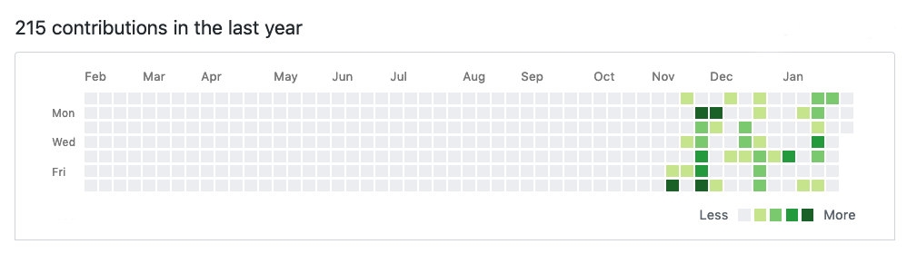

This page aims at showing at a glance my research path, founds, and gems. 
There is a lot of burning topics nowadays ! 
Main frameworks I am using today are presented in the section below, you can also have a look at my Bookmarks if you want, I will do my best to keep this list updated regularly.

<!-- end -->

## IDE

My development environment is based on shared projects between MacOS and Windows, Back/Front-End development and 3D environments. Configuring Windows to execute Linux command, and merging frames in Visual Studio Code makes the bridge between those two. Thank you Microsoft for your last actions towards community developers. Open-source softwares will win, at the very end.

## Frameworks

	

I currently enjoy front development libraries based on Javascript like [Jekyll](https://jekyllrb.com/) and [Gatsby](https://www.gatsbyjs.org/). Deployment from [Npm](https://www.npmjs.com/) is like having a terminal copilot which does the main part of the job for you. It takes a few time to obtain a stable environment but it really worth the time !

## Overview

	

This end of the year has been an exciting field of research around web technologies. My personal main target looking at my contributions is to reach the most linear production as possible, that is to say to enhance predictibility and velocity over incoming year and to improve techniques acquisitions through code writing of course, but also through professional meetings and events where developers and managers shares tips and good practices in order to build faster and better softwares.