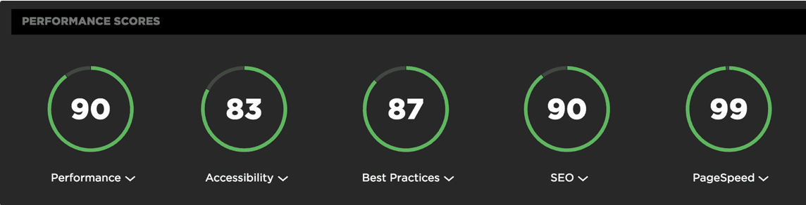
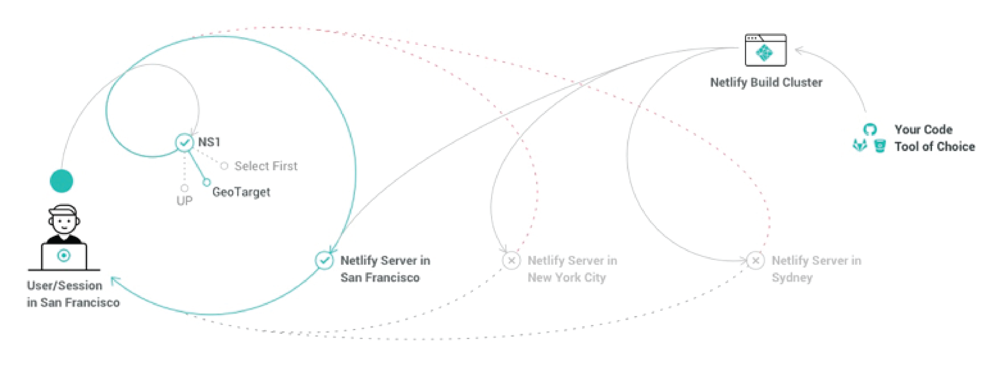

Looking at this blog (made with [Gatbsy.js](https://www.gatsbyjs.org)) and towards Javascript "New Era", I have been very impressed by how far this language, its frameworks and community had evolved to cover all requirements historically made with PHP on server side. This blog gives you a taste of what can be achieved today with those technologies, and its purpose is also to give you the key in order to build your own tools set. Let's have a look at cons, benefits, and new philosophies emerging from this interesting era.

<!-- end -->

## Performances first

As a SEO for example, you might had faced difficulties trying to improve website performances through technical achievements. The main reason is, most of the time, performances have not been considered at the beginning of your development process, during the foundations of your project. In the same way that [code-first approach](https://blog.devart.com/entity-framework-code-first-support-for-oracle-mysql-postgresql-and-sqlite.html), performances-first approach will clean the path to better SEO website performances, keeping architecture clean and sticking to project first intentions.

	
	
Google Chrome Website Audit

Performances described here from Google Chrome Audit shows the potential of such approach. It stands as the best performances I have seen so far without the efforts. Each element is saved and pushed through actual web development best practices, which guarantee optimal balance during deployment.

## Key Performance Indicators (KPI's)

According to today's web requirements, essential points are being covered natively with Gatbsy framework, numbers gathered by the official team refers to : 

* 30% faster load
* 10% longer average session
* 40% lower boucing rate
* 38% more conversions

All of this because their creators think about performances first, efficient routing and deep SEO integrations in every website component. Static publishing for modern web apps, 3rds party CMS integrations and as I said before, performances baked-in (images, code-splitting, etc.).

## Optimization

Because performance is key, you might want to tweak your project with those frameworks in order to achieve better user experience which, in a digital era, is the key to reach more visitors and to make them stay, also making them buying more of your products. Here is the prioritized list you must pay attention to : 

* fast initial page load time
* fast subsequent page interaction (pre-fetching)
* image optimization
* route-based code splitting

As pre-fetching, Server Side Rendering (SSR) is also a dramatic issue being tackled. 

## User Location in Mind

Make your content accessible from anywhere in the world with publishers which will allows CDN [Content Delivery Network](https://www.netlify.com/blog/2016/04/15/make-your-site-faster-with-netlifys-intelligent-cdn/), making your content available faster from the user location.

	
	
Netlify Content Delivery Network

